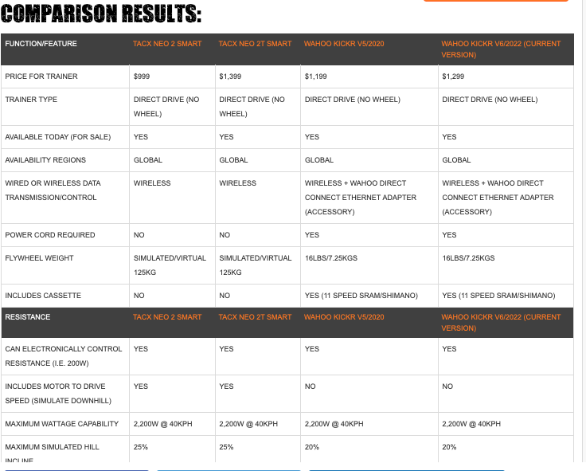

# Home trainer study

## Budget 

- Wahoo kicker core
    - https://werideoncycling-shop.com/products/home-trainer-wahoo-kickr-kore?_pos=1&_sid=f97d72b0d&_ss=r&variant=47111186710871
        - 559 euros (avec fdp) + 50 euros casette (https://werideoncycling-shop.com/products/cassette-11v-shimano-105-r7000?variant=46658265252183) = 610 euros
    - prix recommende 800 euros

- Swift hub
    - https://eu.zwift.com/fr/products/zwift-hub?variant=43413517467899&utm_source=google&utm_medium=cpc&utm_campaign=zwift_eur_fr_cycling_search_plag_ecomm_fre-conversions-23&gad=1&gclid=CjwKCAjwmbqoBhAgEiwACIjzEIFmxvWcQXJw_fl4b_HqUh_wODuIN1zG6N_T5J71qGQf0PzcVQopxxoC79EQAvD_BwE
    - 625 euros (casette et fdp inclus)

 Warning: Ces modeles ne sont pas pliables !!!!

## Middle entry

- Elite suito
    - https://www.rosebikes.fr/elite-suito-t-home-trainer-incl-travel-block-2697439?channable=40302469640032333131323334303187&source=detail&sku=231123401&product_shape=1&article_size=6075&gclid=CjwKCAjwmbqoBhAgEiwACIjzEA768ny7NF3tZtyxWz7hmgtvwEIRn0hgWaQAG1J_8wrHRgxV7pbcTBoCnrgQAvD_BwE
    - 455 euros + 50 euros de casette

- Elite direto XR-T
    - https://www.rosebikes.fr/elite-direto-xr-t-home-trainer-incl-travel-block-2699713?channable=403024696400323331343532393031e0&source=detail&sku=231452901&product_shape=1&article_size=6075&gclid=Cj0KCQjw06-oBhC6ARIsAGuzdw0OHINqpVchyYaQROAWKRYHpNdJsYPabjT4EGtgYOQPR3OXYoFF9UYaAjAAEALw_wcB
    - https://www.bike-components.de/fr/Elite/Home-Trainer-Direto-XR-T-p81720/?o=200001-noir-universal&delivery_country=FR&upid=google&utm_source=google&utm_medium=cpc&utm_campaign=17439572616&utm_content=&utm_term=&gclid=Cj0KCQjw06-oBhC6ARIsAGuzdw2xLXLexKsg3CaA1e_xMjbfDNe4XNbyvPJ_yFRefi1LGSSAVbY7-CMaAjU7EALw_wcB&t=b
        - 570 + 50 euros de casette = 620 euros 
    - prix conseille 850 euros
    - Docs: 
        - https://veloplayer.com/home-trainer/elite/direto-xr/

## Premium 

- Home Trainer Tacx Neo 2 Smart T2850
   - https://www.mantel.com/fr/tacx-neo-2-smart?spec%5B%5D=20107&utm_source=google&utm_medium=shopping&gclid=Cj0KCQjw06-oBhC6ARIsAGuzdw2wFdGoPRvrTqEhyaHOn784K4aIBLVXd2ChxvGgcpwlhrX10bK9gVcaAjJ1EALw_wcB
    - 800 euros + 50 euros de casette = 850 euros 
   - prix conseille 1100 euros

-  Tacx Neo 2T Smart T2875
    - https://www.mantel.com/fr/home-trainer-tacx-neo-2t-smart-t2875?spec%5B%5D=24356&spec%5B%5D=24390&utm_source=google&utm_medium=shopping&gclid=Cj0KCQjwvL-oBhCxARIsAHkOiu2UHVlFa7b6vUtysaDDL3jA3pmF8u7xQR7qbLuetzWhiVIPQJW4kiIaArZTEALw_wcB
        - 1 159,34 euros + 50 euros de cassette
    - Prix conseillé 1 288,26

- **Warning**
    - T2875=Neo 2T
    - T2850=Neo 2
    - Cf. https://www.dcrainmaker.com/2019/11/tacx-neo-2t-smart-trainer-in-depth-review.html (see Post from Patrik)

- We also have the NEO1 : https://www.dcrainmaker.com/2019/11/tacx-neo-2t-smart-trainer-in-depth-review.html

- Wahoo kicker v4 (2018) - refurbished
    - https://fr-eu.wahoofitness.com/devices/indoor-cycling/bike-trainers/reconditioned-kickr-buy-2018 
        - 630 euros - casette fourni
    - 1000 euros new in 2019 

- Whahoo kicker v6 (wifi)
    - https://werideoncycling-shop.com/products/home-trainer-wahoo-kickr-v6-smart-power-trainer-w-wifi?variant=46463671206231&currency=EUR&utm_medium=product_sync&utm_source=google&utm_content=sag_organic&utm_campaign=sag_organic&gclid=Cj0KCQjw9rSoBhCiARIsAFOiplnbFInbXm9BNMK17PiRkUbCwazNS0N4GrkZBFU_eh094kOxlI0GlOEaAl0-EALw_wcB
        - 1100 euros  + 30 euros frais de port  -  casette fourni
    - https://www.alltricks.fr/F-41490-home-training/P-2389861-home_trainer_wahoo_fitness_kickr_v6_wifi 
        - 1100 euros avec fdp
    - prix conseille 1300 euros

- Wahoo kicker v5 - hard to find but could get good discount here
    - https://boutique.bipr.fr/boutique/home-trainer/home-trainer-wahoo-kickr-power-v5-axis/
        - 850 euros (frais de port compris et casette incluse + cle ant (would cost 20 euros) + HRV2P (would cost 30 euros))  
    - Best price seen:
        -  https://www.dealabs.com/bons-plans/home-trainer-wahoo-kickr-v5-2438294 792euros
        - https://www.dealabs.com/bons-plans/wahoo-kickr-v5-2509173 700 euros
        -  (700 euros all tricks form google search?)
    - A la sortie 1200 euros: https://thepaincave.net/le-nouveau-wahoo-kickr-2020/
    - pas cher ici: https://www.chainreactioncycles.com/p/wahoo-kickr-smart-turbo-trainer?utm_source=affiliate-window&utm_medium=affiliates&utm_campaign=TechRadar&utm_term=Future+Publishing.&utm_content=Editorial+Content&awc=2698_1695473379_228bb27cedb2f81d90e0700f09c845ba&sv_campaign_id=103504&sv_tax1=affiliate&sv_tax2=375403%7C375413%7C375415&sv_tax3=Future+Publishing.&sv_tax4=0&sv_affiliate_id=103504 -> 600 euros  (but not delivered in france + UK/US plug)
        - https://www.idealo.fr/prix/200703255/wahoo-kickr-v5.html

    

## Casette compatible

- Canyon : https://github.com/scoulomb/sports/blob/main/bikes/CanyonWebsite/output-diff-endurace-outlet-new.txt#L36

- https://www.bike-components.de/fr/Shimano/Cassette-CS-HG700-11-11-vitesses-p62072/?o=300330-argente-11-34&t=b

## Release date 

- Kickr v5 : 2020      (https://zwiftinsider.com/smart-trainer/wahoo-kickr-5/)
- Kickr v6 : 2022      (https://www.cyclingnews.com/reviews/wahoo-kickr-2022-turbo-trainer/)
- Neo2 2850: 2018 Nov  (http://www.veloptimal.com/forum/viewtopic.php?f=7&t=8036&p=955414)
- Neo2T2875 :2019      (https://www.smartbiketrainers.com/tacx-releases-the-neo-2-smart-bike-trainer-6297, https://zwiftinsider.com/tacx-neo-2t-review/#:~:text=Despite%20being%20released%20in%20September,in%20the%20indoor%20training%20space.)
    - https://www.coachweb.com/gear/cycling-gear/tacx-neo-2t-review#:~:text=The%20Tacx%20Neo%202T%20was,it%20listed%20for%20%C2%A3959). 8aug22
    - > The Tacx Neo 2T was released in September 2019 and costs $1,399.99 in the US and £1,199.99 in the UK (although, at the time of writing, we’ve seen it listed for £959).

## Good post

### Neo 2/2T or Kickr Core v5/6

- https://www.cycling.io/tacx-neo-2t-vs-wahoo-kickr/
    - > So while the NEO 2T is more expensive, it includes more standard features — making it one of the big reasons as to why it’s such a popular purchase for at-home cycling enthusiasts.
    - **So it compares kickr v5 with Neo 2T (and not neo 2)**
- https://thepaincave.net/quel-home-trainer-choisir-en-2022/
    - Same here **it compares kickr v5 with Neo 2T (and not neo 2)**
 - https://www.cyclingnews.com/features/tacx-neo-2t-vs-wahoo-kickr-2022/
    - neo2t    : Price: £1,199    / $1,399.99 / €1,299    / $1,999.00 AUD
    - kickr v6 : Price: £1,099.99 / $1,299.99 / €1,299.99 / AUD $1,799.95
    - **it compares kickr v6 (and not the v5) with Neo 2T (and not neo 2)**
 - https://www.materiel-velo.com/infos/fr/meilleur-home-trainer-connecte/
    - **it compares kickr v6 (and not the v5) with Neo 2T (and not neo 2)**

- https://velo-critique.com/home-trainer/tacx/neo-2t-smart/
    - > Suite à l’annonce de ce nouveau NEO 2T Smart de chez Tacx, nous avons décidé de nous le procurer afin de pouvoir le tester et ainsi pouvoir le comparer avec ses prédécesseurs. À savoir le NEO 1 et le NEO 2. Mais aussi avec ses concurrents directs, le Wahoo Fitness Kickr V5 
    - **So it compares kickr v5 with Neo 2T (and not neo 2)**

### Other
- https://www.dcrainmaker.com/2019/11/tacx-neo-2t-smart-trainer-in-depth-review.html 
- https://www.coachweb.com/gear/cycling-gear/tacx-neo-2t-review
- https://zwiftinsider.com/smart-trainer/tacx-neo-2t/
    - > One of the best, but will it last a lifetime 
- On TACX SAV 
    - https://www.troc-velo.com/fr-fr/forum/topic/home-trainer-tacx-neo-2-t-91154/2

## Conclusion 

Under 850 Euros (my budget), best product I can have at time of writing (see above)
- kickr v5 (850 euros)
- Neo 2 (850 euros)

A lot of post/comment mentions the Neo 2T (2019) is more expensive (100/200 euros) than Kickr V5/V6 (2020/2022 year). But it could worth it, though I do not like build quality of Neo2T in plastic.

I believed we could get it for same price of 850 at time of writing, thus a dilemma.
But it is not the case as the Neo 2 worth 850 but Neo2T is still >1000 euros. Still no major diff between neo 2 and neo2t: https://www.dcrainmaker.com/2019/11/tacx-neo-2t-smart-trainer-in-depth-review.html

So we actually still have this price difference between kickr v5/6 and Neo2T (where I prefer to not put 200 more for something in plastic).

It confirms my choice of Kickr v5 which I personally prefer, seems more robust in time (I hate plastic), more recent (release 2 years after). And often compared to Neo 2T (and not Neo 2)

Tacx model name are very confusing  
- Home Trainer Tacx Neo 2 Smart T2850
- Tacx Neo 2T Smart T2875

It is also well visible in this comparison (price are launching price)
https://www.dcrainmaker.com/product-comparison-calculator?type=trainer&ids=92332%2C102705%2C115732%2C138418#results
<!-- https://www.dcrainmaker.com/2019/11/tacx-neo-2t-smart-trainer-in-depth-review.html -->

It should not drive decsion but casette is also pre-mounted on v5.

Conclusion: Buy kickr v5 for 850 euros.